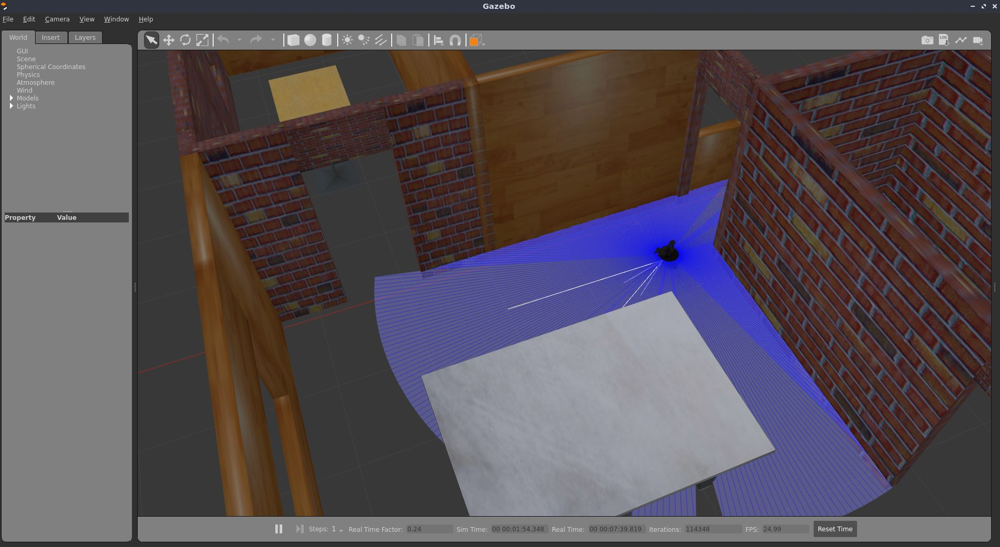
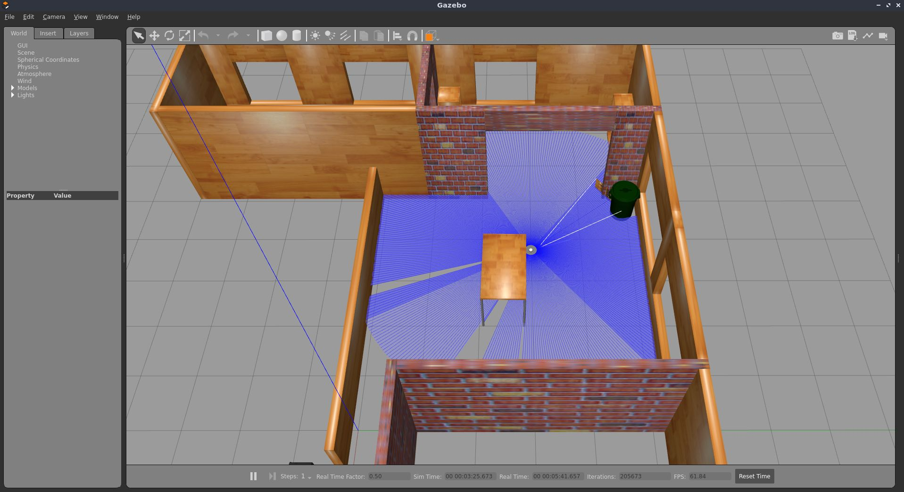
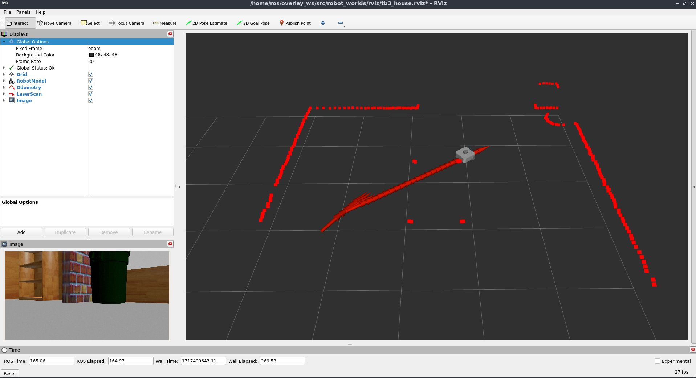
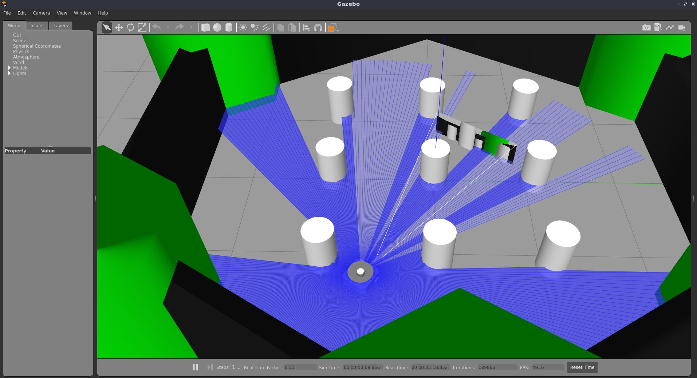
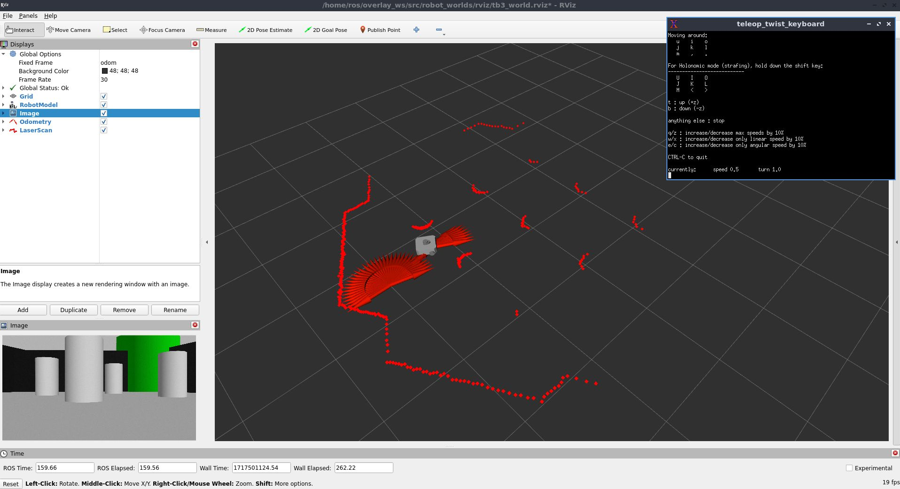

# ROS Gazebo Worlds Collection

Collection of Gazebo ROS Simulation environments from various sources and prepared for testing with different ROS packages. 

# setup / usage

## docker based workflow setup (recommended)

build the docker images (base ros2 > development overlay)

```
# move to workspace directory
cd ws_robot_worlds
```
```
./src/robot_worlds/docker/build_docker.sh 
```
If the build is successful, run the docker container with the development workspace. The local folders are mounted to the docker workspace when running. this allows you to edit/view your code directly on your filesystem, which runs in the docker container.

run:
```
./src/robot_worlds/docker/run_docker.sh 
```

This opens up a bash terminal in a new preconfigured and sourced ROS2 workspace.

Proceed to build and source your workspace
```
colcon build --symlink-install && source install/setup.bash
```

## manual local setup (linux)
```
mkdir -p robot_worlds_ws/src
cd robot_worlds_ws

git clone https://github.com/yojuna/robot-worlds

colcon build --symlink-install
source install/setup.bash
```
handle missing dependencies
```
rosdep install --from-paths src -y --ignore-src
```
or install manually if somethings gets missed.

- index for different launch files to be included eventually. 

# Le Robots

## Turtlebot3 with Open Manipulator X



run,
```
ros2 launch robot_worlds tb3_om_gz_moveit.launch.py
```

## Turtlebot3 [Waffle, Waffle Pi, Burger]


tb3 simulation setup guide: https://emanual.robotis.com/docs/en/platform/turtlebot3/simulation/

```
cd  src
git clone -b humble-devel https://github.com/ROBOTIS-GIT/turtlebot3_simulations.git
cd ../
colcon build --symlink-install && source install/setup.bash
```

Run the tb3 world simulation

```
ros2 launch robot_worlds tb3_world.launch
```

### note:
if gazebo throws errors when using with docker:
run:
```
. /usr/share/gazebo/setup.sh
```
this sets up necessary gazebo environment variables and other things. ref: https://answers.ros.org/question/358847/cannot-launch-gzclient-on-a-launch-file-results-in-shared_ptr-assertion-error/

# Worlds


## Turtlebot3 Simulations

Turtlebot3 simulation worlds

reference: [robotis turtlebot3 E manual ](https://emanual.robotis.com/docs/en/platform/turtlebot3/simulation/)

### Gazebo House World


after building, run,
```
export TURTLEBOT3_MODEL=waffle 
ros2 launch robot_worlds tb3_house.launch.py
```
This starts gazebo with preconfigured rviz (camera, odom, laserscan in the /odom global frame) and a teleop node to move the turtlebot around.




### Gazebo World



run,
```
export TURTLEBOT3_MODEL=waffle 
ros2 launch robot_worlds tb3_world.launch.py
```


---

# credits / sources

This repository would not have been possible without the painstaking work of these references:

- [Turtlebot3 Simulations](https://github.com/ROBOTIS-GIT/turtlebot3_simulations/tree/ros2)

- [Gazebo models and worlds collection](https://github.com/leonhartyao/gazebo_models_worlds_collection)
    - referred sources:
        - [3DGEMS](http://data.nvision2.eecs.yorku.ca/3DGEMS/)
        - [RotorS](https://github.com/ethz-asl/rotors_simulator)
        - [TU Delft](https://github.com/tudelft/gazebo_models)
        - [ARTI-Robots](https://github.com/ARTI-Robots/gazebo_worlds)
        - [Clearpath Robotics](https://github.com/clearpathrobotics/cpr_gazebo)
        - [Fetch Robotics](https://github.com/fetchrobotics/fetch_gazebo)

- [Dataset-of-Gazebo-Worlds-Models-and-Maps](https://github.com/mlherd/Dataset-of-Gazebo-Worlds-Models-and-Maps)

- [PX4 Gazebo worlds](https://dev.px4.io/v1.11_noredirect/en/simulation/gazebo_worlds.html)

- [Gazebo Small Warehouse, Bookstore and Small House worlds available for simulation | ROS Discourse](https://discourse.ros.org/t/gazebo-small-warehouse-bookstore-and-small-house-worlds-available-for-simulation/14915)


## Dataset-of-Gazebo-Worlds-Models-and-Maps
- A set of Gazebo worlds models and maps that I use for testing Navigation2
- These models are tested using Gazebo 9 and Gazebo 11.

### Usage
1- Copy the model you want to use in .gazebo/models directory.

or

- Set Gazebo model path for the worlds with models directory

2- Gazebo -> Insert -> <World_Model_Name>

or

- go to gazebo word directory and type `gazebo example.world`

Most models come with maps.
### Models:

### AWS Small House
 - `export GAZEBO_MODEL_PATH=/home/<user_name>/.gazebo/models/small_house/models/`
 - `gazebo small_house.world`
 

### AWS Office
 - `export GAZEBO_MODEL_PATH=/home/<user_name>/.gazebo/models/office/models/`
 - `gazebo office.world`
 
 
### AWS Bookstore
 - `export GAZEBO_MODEL_PATH=/home/<user_name>/.gazebo/models/bookstore/models/`
 - `gazebo bookstore.world`
 

### AWS Hospital
 - unzip the models_part# into a dicrectory called models
 - `export GAZEBO_MODEL_PATH=/home/<user_name>/.gazebo/models/hospital/models/`
 - `gazebo hospital.world`
 - `gazebo hospital_two_floors.world`
 
 
 #### Hospital with Two Floors
 
 

### Custom Factory
 - `export GAZEBO_MODEL_PATH=/home/<user_name>/.gazebo/models/factory/models/`
 - `gazebo factory.model`
 

### Dynamic World
 - A world with 9 dynamic obstacles that randomly move around.
 
 
### Random World
  - A test model generated by using my random map generation tool.

 
### Robotis Turtlebot 3 World


### Experiment Rooms
  - `export GAZEBO_MODEL_PATH=/home/<user_name>/experiment_rooms/models/`
  - `cd experiment_rooms/worlds/room1`
  - `gazebo world_dynamic.model`


### 10x10 Rooms with Walls
  - Empty room models with different shapes


