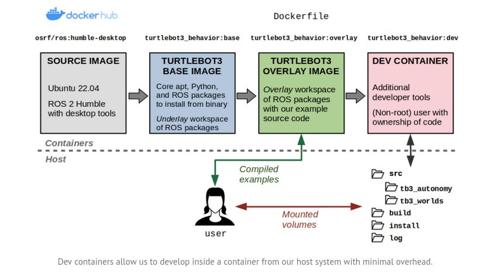
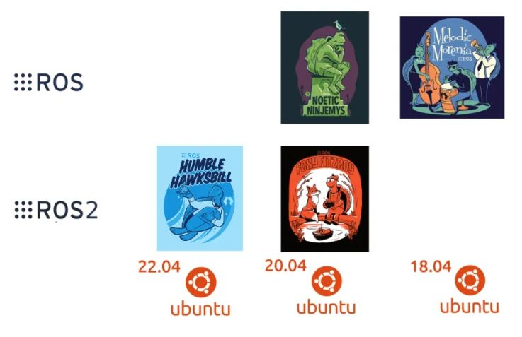

# robot_worlds

## TODOs

1. ROS gazebo GPU docker
    - base image with all requirements

2. Models/Worlds loading dev environemnt docker
    - layer over the base image
    - VSCode support eventually

3. Eventually/for kicks & grok: kubernetes (container orchestration support for local and cloud setups)
--- 

## wiki/guide notes

### dockers

    - use layers of images
    - add dev container support

#### setup

start from nvidia cuda base image
in dockerfile:
    - install gazebo and ros
    https://gazebosim.org/docs/harmonic/ros_installation

Docker files reside in the docker folder.
run 

#### ROS Dev containers:



#### dev containers


- ref: [GH: Dev Container Build and Run (devcontainers/ci)](https://github.com/devcontainers/ci)
    - The Dev Container Build and Run GitHub Action is aimed at making it easier to re-use Dev Containers in a GitHub workflow. 

#### refs: 

[Robotic Sea Bass: A Guide to Docker and ROS](https://roboticseabass.com/2021/04/21/docker-and-ros/)
Great guide for understanding multi stage builds & instructive github repository for ROS docker workflows: [GH: sea-bass / turtlebot3_behavior_demos](https://github.com/sea-bass/turtlebot3_behavior_demos)
[Robotic Sea Bass: An Updated Guide to Docker and ROS 2](https://roboticseabass.com/2023/07/09/updated-guide-docker-and-ros2/)

### gazebo versions 

Always been plagued with the question of which gz ros versions to put together.
[Gazebo Doc: Summary of Compatible ROS and Gazebo Combinations](https://gazebosim.org/docs/harmonic/ros_installation#summary-of-compatible-ros-and-gazebo-combinations)
TL;DR
- ROS 2 (Humble) - GZ Fortress
- ROS Noetic - GZ Citadel

Recommended (from Gazebo docs) to use default version of Gazebo available from the ROS repository when installing ros_gz. The following command will install the correct version of Gazebo and ros_gz for your ROS installation on a Linux system. You should replace ${ROS_DISTRO} with your ROS distribution (e.g. humble, rolling,foxy, noetic, etc).

```
sudo apt-get install ros-${ROS_DISTRO}-ros-gz
```
- ref: [Installing the Default Gazebo/ROS Pairing](https://gazebosim.org/docs/harmonic/ros_installation#installing-the-default-gazebo-ros-pairing)


ROS Ubuntu compatible versions:



- ref: [ubuntu blog: ROS versions](https://ubuntu.com/blog/ros-foxy-ros-melodic-eol)
### ubu


---

# tasks

## TODO:
    - index and restructure directories for all robot and world models 
    - add description, specific credits, usage info and images for each world & robot
    - add specific launch files for all worlds
        - Note: error while launching world with tb3, must be some kind of path error; need to fix
    - add launch files with configurable launch arguments for different robots and worlds
    - add nav2 library, interfaced modularly with repository

# dev log

## 15th Jan 
    - revisiting existing code to see how much has 'atrophied'
    - started adding support for other world models with the tb3 robot spawn
    - multiple problems atm, 
        - tb3 spawn launches but world file does not load
        - other world models from other repositories: tried turtlebot3_house, hospital and office. facing slightly different kinds of path issues; need to resolve asap.
            - tried modifying launch files to handle this, work in progress atm.
        - repo is getting too large due to copying other repository models/meshes -- add support for making specific world repositories/folder into recursive submodules from the latest upstream repositories
            - user can also sparse checkout any specific repo instead of whole collection

# directory structure

## index

```
(ros2) nemo@homelab:~/code/repos/roboforge_dev/robot_worlds_ws$ tree -L 1 src/robot_worlds/worlds/
src/robot_worlds/worlds/
├── bookstore
├── dynamic_obstacle
├── dynamic_world
├── empty_room
├── experiment_rooms
├── factory
├── hospital
├── office
├── random_world
├── room_with_walls_1
├── room_with_walls_2
├── small_house
├── star_room_with_walls
├── turtlebot3_dqn_world
├── turtlebot3_house
└── turtlebot3_world

16 directories, 0 files
```


## directories and files

```
(ros2) nemo@homelab:~/code/repos/roboforge_dev/robot_worlds_ws$ tree -L 2 src/robot_worlds/worlds/
src/robot_worlds/worlds/
├── bookstore
│   ├── bookstore.jpg
│   ├── bookstore.world
│   ├── bookstore.zip
│   └── models
├── dynamic_obstacle
│   ├── model.config
│   └── model.sdf
├── dynamic_world
│   ├── dynamic_room.jpg
│   └── world.model
├── empty_room
│   ├── maps
│   ├── model.config
│   └── model.sdf
├── experiment_rooms
│   ├── experiment_rooms.png
│   ├── models
│   ├── pics
│   ├── README.md
│   └── worlds
├── factory
│   ├── factory.jpg
│   ├── factory.model
│   └── models
├── hospital
│   ├── hospital.png
│   ├── hospital_two_floors.world
│   ├── hospital.world
│   ├── models
│   ├── models_part1.zip
│   ├── models_part2.zip
│   ├── models_part3.zip
│   ├── models_part4.zip
│   ├── photos
│   ├── two_floor.png
│   └── unzip_models.sh
├── office
│   ├── map
│   ├── media
│   ├── models
│   ├── office.jpg
│   ├── office_part1.zip
│   ├── office_part2.zip
│   └── service.world
├── random_world
│   ├── media
│   ├── model.config
│   ├── model.sdf
│   └── random_world.jpg
├── room_with_walls_1
│   ├── map_0.05m-px.png
│   ├── map_0.1m-px.png
│   ├── map.yaml
│   ├── room_with_walls_10x10
│   └── simple_rooms.png
├── room_with_walls_2
│   ├── map_0.05m-px.png
│   ├── map_0.1m-px.png
│   ├── map.yaml
│   └── room3
├── small_house
│   ├── maps
│   ├── models
│   ├── photos
│   ├── small_house
│   ├── small_house.jpg
│   ├── small_house.world
│   └── small_house.zip
├── star_room_with_walls
│   ├── map_0.05m-px.png
│   ├── map_0.1m-px.png
│   ├── map.yaml
│   └── room_with_walls_star
├── turtlebot3_dqn_world
│   ├── goal_box
│   ├── inner_walls
│   ├── model.config
│   ├── model.sdf
│   ├── obstacle1
│   ├── obstacle2
│   ├── obstacle_plugin
│   ├── obstacles
│   ├── turtlebot3_dqn_stage1.world
│   ├── turtlebot3_dqn_stage2.world
│   ├── turtlebot3_dqn_stage3.world
│   └── turtlebot3_dqn_stage4.world
├── turtlebot3_house
│   ├── model.config
│   ├── model.sdf
│   └── turtlebot3_house.world
└── turtlebot3_world
    ├── empty_world.world
    ├── maps
    ├── meshes
    ├── model-1_4.sdf
    ├── model.config
    ├── model.sdf
    ├── tb_world.jpg
    └── turtlebot3_world.world

43 directories, 57 files

```

---


